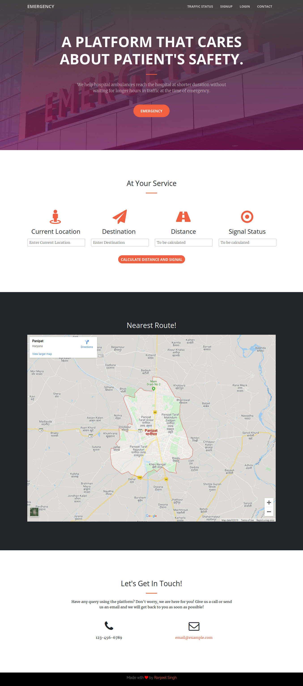
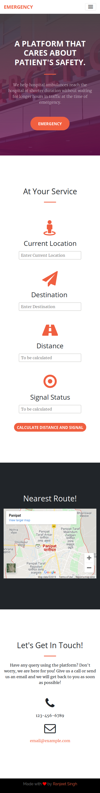

# Emergency

A Web app which lets the ambulance driver to get information about the traffic so that it can request TCMS(Traffic control management system) to turn the traffic signals to green when the vehicle reaches near any signal so as to avoid traffic and delay in taking patient to hospital. This will help in providing a better approach towards the patient's safety.

Landing Page for the Application.

#Desktop View

#Mobile View

# Contributions

1. Contibutions are welcomed.
2. Do not work in master branch
3. create new branch and pull request for the changes you made.
